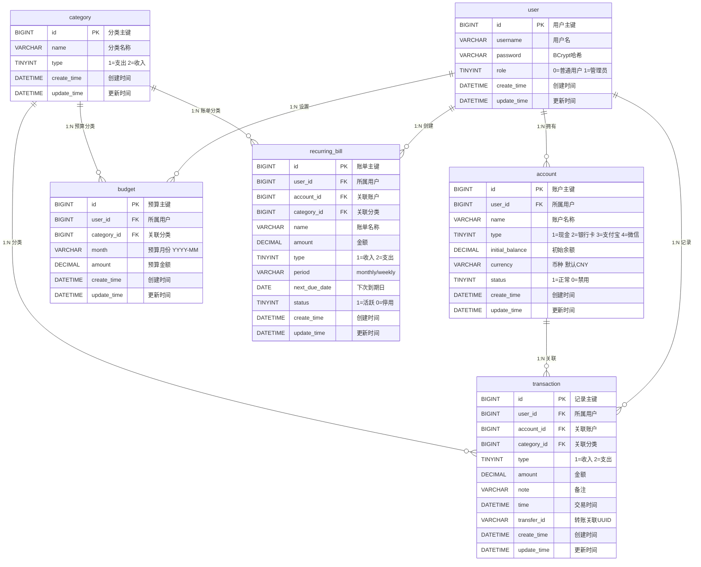

# 个人财务记账与分析系统 · 数据库设计

> 版本: v2.0 · 生成日期: 2026-05-16 · 依据: `docs/PRD.md`（R-01 已审已修）+ `docs/TECH_DESIGN.md` §1-§6（R-02 + R-02b 已审已修）
> 数据库名: `finance_db`（与 `application.yml` 的 `spring.datasource.url` 一致）

---

## 1. ER 图



---

## 2. 表清单与关系说明

| # | 表名 | 用途 | 实现优先级 | 主要关系 |
|---|---|---|:---:|---|
| 1 | user | 用户基本信息（用户名 + BCrypt 密码哈希） | P0 | 1:N → account / 1:N → transaction / 1:N → budget / 1:N → recurring_bill |
| 2 | account | 多账户管理（现金/银行卡/支付宝/微信） | P0 | N:1 → user / 1:N → transaction / 1:N → recurring_bill · 软删除通过 status=0 实现 |
| 3 | category | 收支分类种子数据（支出 8 + 收入 5 = 13 条） | P0 | 1:N → transaction / 1:N → budget / 1:N → recurring_bill · 不做用户自定义增改删 |
| 4 | transaction | 收支流水记录（含转账关联） | P0 | N:1 → user / N:1 → account / N:1 → category · transfer_id 非空=转账记录 |
| 5 | budget | 月预算按分类设置 | P1 | N:1 → user / N:1 → category · 同用户+同分类+同月唯一约束 |
| 6 | recurring_bill | 周期性收支模板（月租/工资等） | P1 | N:1 → user / N:1 → account / N:1 → category · 软删除通过 status=0 实现 |

**表间关系说明**：
- user → account/transaction/budget/recurring_bill 均为 1:N，通过 user_id 关联
- account → transaction 为 1:N，通过 account_id 关联（查询某账户所有流水）
- category → transaction/budget/recurring_bill 均为 1:N，通过 category_id 关联
- transaction 表内部通过 transfer_id（UUID）自关联实现转账记录配对（两条记录共享同一 UUID）
- 不建物理外键约束（教学简化，应用层校验关联完整性，见 §4 第 8 条）

---

## 3. CREATE TABLE 完整 SQL

> 注：以下 SQL 与 `sql/01-init.sql` 保持同步。

### 3.1 user（用户表 · P0）

```sql
CREATE TABLE `user` (
  `id`          BIGINT        NOT NULL AUTO_INCREMENT  COMMENT '用户主键',
  `username`    VARCHAR(20)   NOT NULL                 COMMENT '用户名（3-20位字母/数字/下划线）',
  `password`    VARCHAR(100)  NOT NULL                 COMMENT 'BCrypt加密后的密码哈希值（@JsonIgnore防响应泄漏）',
  `create_time` DATETIME      NOT NULL DEFAULT CURRENT_TIMESTAMP                COMMENT '创建时间',
  `update_time` DATETIME      NOT NULL DEFAULT CURRENT_TIMESTAMP ON UPDATE CURRENT_TIMESTAMP COMMENT '更新时间',
  PRIMARY KEY (`id`),
  UNIQUE KEY `uk_user_username` (`username`)
) ENGINE=InnoDB DEFAULT CHARSET=utf8mb4 COLLATE=utf8mb4_unicode_ci COMMENT='用户表';
```

- **索引**: `uk_user_username` (username) — 唯一索引防并发注册重复用户名
- **业务规则**: 密码存 BCrypt 哈希，明文禁止入库；username 唯一约束兜底并发注册
- **对应 PRD**: P0-1 登录/JWT

### 3.2 account（账户表 · P0）

```sql
CREATE TABLE `account` (
  `id`              BIGINT        NOT NULL AUTO_INCREMENT  COMMENT '账户主键',
  `user_id`         BIGINT        NOT NULL                 COMMENT '所属用户ID（N:1 → user）',
  `name`            VARCHAR(20)   NOT NULL                 COMMENT '账户名称（1-20字符，如：现金、支付宝）',
  `type`            TINYINT       NOT NULL                 COMMENT '账户类型：1=现金, 2=银行卡, 3=支付宝, 4=微信',
  `initial_balance` DECIMAL(12,2) NOT NULL DEFAULT 0.00    COMMENT '初始余额（精度2位，禁用FLOAT/DOUBLE）',
  `currency`        VARCHAR(3)    NOT NULL DEFAULT 'CNY'   COMMENT '币种代码：CNY/USD/EUR/JPY/GBP/HKD（默认CNY）',
  `status`          TINYINT       NOT NULL DEFAULT 1       COMMENT '状态：1=正常, 0=禁用（软删除，禁用后不可恢复）',
  `create_time`     DATETIME      NOT NULL DEFAULT CURRENT_TIMESTAMP                COMMENT '创建时间',
  `update_time`     DATETIME      NOT NULL DEFAULT CURRENT_TIMESTAMP ON UPDATE CURRENT_TIMESTAMP COMMENT '更新时间',
  PRIMARY KEY (`id`),
  KEY `idx_account_user_id` (`user_id`)
) ENGINE=InnoDB DEFAULT CHARSET=utf8mb4 COLLATE=utf8mb4_unicode_ci COMMENT='账户表';
```

- **索引**: `idx_account_user_id` (user_id) — 按用户查询账户列表
- **type 枚举**: 1=现金 / 2=银行卡 / 3=支付宝 / 4=微信（覆盖 PRD P0-2 四种账户类型）
- **currency**: 默认 CNY，支持 6 种固定币种（对齐 PRD P2-4 多币种支持 + TECH_DESIGN §6.3 表单字段）
- **status 并发保护**: 软删除用条件 UPDATE (`UPDATE account SET status=0 WHERE id=? AND status=1`)，按 affectedRows 判断是否重复禁用
- **业务规则**: 删除改 status=0（软删除），禁用后不可恢复；不同账户可同名
- **对应 PRD**: P0-2 账户 CRUD + P0-5 按账户汇总余额

### 3.3 category（分类表 · 种子数据 · P0）

```sql
CREATE TABLE `category` (
  `id`          BIGINT       NOT NULL AUTO_INCREMENT  COMMENT '分类主键',
  `name`        VARCHAR(10)  NOT NULL                 COMMENT '分类名称（1-10字符）',
  `type`        TINYINT      NOT NULL                 COMMENT '分类类型：1=支出, 2=收入',
  `create_time` DATETIME     NOT NULL DEFAULT CURRENT_TIMESTAMP                COMMENT '创建时间',
  `update_time` DATETIME     NOT NULL DEFAULT CURRENT_TIMESTAMP ON UPDATE CURRENT_TIMESTAMP COMMENT '更新时间',
  PRIMARY KEY (`id`)
) ENGINE=InnoDB DEFAULT CHARSET=utf8mb4 COLLATE=utf8mb4_unicode_ci COMMENT='收支分类表（种子数据）';
```

- **种子数据**（由 sql/01-init.sql 预置）:
  - 支出（type=1）: 餐饮、交通、购物、住房、娱乐、医疗、教育、其他（8 条）
  - 收入（type=2）: 工资、奖金、兼职、理财、其他（5 条）
- **业务规则**: 种子数据，不做用户自定义增改删（教学简化）
- **对应 PRD**: P0-3 分类 GET 列表

### 3.4 transaction（收支记录表 · P0）

```sql
CREATE TABLE `transaction` (
  `id`          BIGINT        NOT NULL AUTO_INCREMENT  COMMENT '记录主键',
  `user_id`     BIGINT        NOT NULL                 COMMENT '所属用户ID（N:1 → user）',
  `account_id`  BIGINT        NOT NULL                 COMMENT '关联账户ID（N:1 → account）',
  `category_id` BIGINT        NOT NULL                 COMMENT '关联分类ID（N:1 → category）',
  `type`        TINYINT       NOT NULL                 COMMENT '交易类型：1=收入, 2=支出（转账时生成一收一支两条记录）',
  `amount`      DECIMAL(12,2) NOT NULL                 COMMENT '金额（必须>0，精度2位，禁用FLOAT/DOUBLE）',
  `note`        VARCHAR(200)  DEFAULT NULL             COMMENT '备注（≤200字符，可为空；NULL=无备注）',
  `time`        DATETIME      NOT NULL                 COMMENT '交易时间（ISO 8601格式）',
  `transfer_id` VARCHAR(36)   DEFAULT NULL             COMMENT '转账关联ID（UUID；NULL=普通收支记录，非NULL=转账关联记录，流水列表需标记转出/转入）',
  `create_time` DATETIME      NOT NULL DEFAULT CURRENT_TIMESTAMP                COMMENT '创建时间',
  `update_time` DATETIME      NOT NULL DEFAULT CURRENT_TIMESTAMP ON UPDATE CURRENT_TIMESTAMP COMMENT '更新时间',
  PRIMARY KEY (`id`),
  KEY `idx_transaction_user_id`      (`user_id`),
  KEY `idx_transaction_account_id`   (`account_id`),
  KEY `idx_transaction_time`         (`user_id`, `time`),
  KEY `idx_transaction_transfer_id`  (`transfer_id`)
) ENGINE=InnoDB DEFAULT CHARSET=utf8mb4 COLLATE=utf8mb4_unicode_ci COMMENT='收支记录表';
```

- **索引**:
  - `idx_transaction_user_id` (user_id) — 按用户查询流水
  - `idx_transaction_account_id` (account_id) — 按账户统计收支
  - `idx_transaction_time` (user_id, time) — 复合索引，时间范围筛选（P1-1 多条件筛选）
  - `idx_transaction_transfer_id` (transfer_id) — 转账关联查询
- **NULL 业务语义**:
  - `note DEFAULT NULL`: 无备注，列表展示为空
  - `transfer_id DEFAULT NULL`: NULL 表示普通收支记录（正常展示编辑按钮）；非 NULL 表示转账关联记录（隐藏编辑按钮，标记转出/转入 + 展示关联账户名称）
- **余额并发保护**: 余额实时计算（初始余额 + SUM(收入) - SUM(支出)），不在 transaction 表存储余额字段；转账操作使用 `@Transactional` 事务包裹余额检查 + 两条 INSERT，利用 InnoDB REPEATABLE READ 隔离级别防并发透支
- **业务规则**:
  - type 取值 {1=收入, 2=支出}；转账时生成两条记录（一收入一支出），通过 transfer_id（UUID）关联
  - transfer_id 非空时为转账关联记录，禁止修改金额（仅可修改备注）
  - 余额实时计算，不做缓存
- **对应 PRD**: P0-4 收支记录 + P1-1 多条件筛选 + P1-5 转账功能

### 3.5 budget（预算表 · P1）

```sql
CREATE TABLE `budget` (
  `id`          BIGINT        NOT NULL AUTO_INCREMENT  COMMENT '预算主键',
  `user_id`     BIGINT        NOT NULL                 COMMENT '所属用户ID（N:1 → user）',
  `category_id` BIGINT        NOT NULL                 COMMENT '关联分类ID（N:1 → category，仅支出分类）',
  `month`       VARCHAR(7)    NOT NULL                 COMMENT '预算月份（格式YYYY-MM，如2026-05）',
  `amount`      DECIMAL(12,2) NOT NULL                 COMMENT '预算金额（必须>0，精度2位，禁用FLOAT/DOUBLE）',
  `create_time` DATETIME      NOT NULL DEFAULT CURRENT_TIMESTAMP                COMMENT '创建时间',
  `update_time` DATETIME      NOT NULL DEFAULT CURRENT_TIMESTAMP ON UPDATE CURRENT_TIMESTAMP COMMENT '更新时间',
  PRIMARY KEY (`id`),
  UNIQUE KEY `uk_budget_user_category_month` (`user_id`, `category_id`, `month`),
  KEY `idx_budget_user_month` (`user_id`, `month`)
) ENGINE=InnoDB DEFAULT CHARSET=utf8mb4 COLLATE=utf8mb4_unicode_ci COMMENT='预算表';
```

- **唯一约束**: `uk_budget_user_category_month` (user_id, category_id, month) — 同一用户+同一分类+同一月份仅一条预算（覆盖写入）
- **索引**: `idx_budget_user_month` (user_id, month) — 按用户+月份查询预算列表
- **并发保护**: 唯一约束兜底并发重复插入；更新用 INSERT ... ON DUPLICATE KEY UPDATE 实现"有则更新、无则插入"
- **业务规则**: 预算粒度为月；仅适用于支出分类；未设置预算的分类不参与超支判断
- **对应 PRD**: P1-3 预算管理

### 3.6 recurring_bill（周期性账单表 · P1）

```sql
CREATE TABLE `recurring_bill` (
  `id`            BIGINT        NOT NULL AUTO_INCREMENT  COMMENT '账单主键',
  `user_id`       BIGINT        NOT NULL                 COMMENT '所属用户ID（N:1 → user）',
  `account_id`    BIGINT        NOT NULL                 COMMENT '关联账户ID（N:1 → account）',
  `category_id`   BIGINT        NOT NULL                 COMMENT '关联分类ID（N:1 → category）',
  `name`          VARCHAR(30)   NOT NULL                 COMMENT '账单名称（1-30字符，如：房租、工资）',
  `amount`        DECIMAL(12,2) NOT NULL                 COMMENT '金额（必须>0，精度2位，禁用FLOAT/DOUBLE）',
  `type`          TINYINT       NOT NULL                 COMMENT '类型：1=收入, 2=支出',
  `period`        VARCHAR(10)   NOT NULL                 COMMENT '周期：monthly=每月, weekly=每周',
  `next_due_date` DATE          NOT NULL                 COMMENT '下次到期日（@Scheduled日检到期依据）',
  `status`        TINYINT       NOT NULL DEFAULT 1       COMMENT '状态：1=活跃, 0=停用（软删除，停用后不可恢复）',
  `create_time`   DATETIME      NOT NULL DEFAULT CURRENT_TIMESTAMP                COMMENT '创建时间',
  `update_time`   DATETIME      NOT NULL DEFAULT CURRENT_TIMESTAMP ON UPDATE CURRENT_TIMESTAMP COMMENT '更新时间',
  PRIMARY KEY (`id`),
  KEY `idx_recurring_bill_user_id` (`user_id`),
<!-- R-03-issue-2: 已修复 - 追加 account_id 和 category_id 索引 -->
  KEY `idx_recurring_bill_account_id` (`account_id`),
  KEY `idx_recurring_bill_category_id` (`category_id`)
) ENGINE=InnoDB DEFAULT CHARSET=utf8mb4 COLLATE=utf8mb4_unicode_ci COMMENT='周期性账单表';
```

- **索引**:
  - `idx_recurring_bill_user_id` (user_id) — 按用户查询账单列表
  - `idx_recurring_bill_account_id` (account_id) — 一键生成时校验关联账户状态（PRD P1-4 异常流程②）
  - `idx_recurring_bill_category_id` (category_id) — 按分类筛选账单
- **status 并发保护**: 停用用条件 UPDATE (`UPDATE recurring_bill SET status=0 WHERE id=? AND status=1`)，按 affectedRows 判断是否重复停用；一键生成时用条件 UPDATE (`WHERE next_due_date = 当前值`) 防同一到期日被重复生成
- **业务规则**:
  - 停用改 status=0（软删除），停用后不可恢复（与 account 禁用模式一致）
  - 一键生成收支记录时，校验关联账户 status=1，否则拒绝生成（PRD P1-4 异常流程②）
  - 活跃账单（status=1）引用的账户被禁用后，该账单在列表中标记异常；已停用账单（status=0）不受影响
- **对应 PRD**: P1-4 周期性账单提醒

---

## 4. 测试数据（INSERT 语句）

> 按外键依赖顺序：user → account → category(种子) → transaction → budget → recurring_bill

### 4.1 user（2 条测试用户）

```sql
INSERT INTO `user` (`username`, `password`) VALUES
  ('zhangsan', '$2a$10$N9qo8uLOickgx2ZMRZoMyeIjZAgcfl7p92ldGxad68LJZdL17lhWy'),
  ('lisi',     '$2a$10$N9qo8uLOickgx2ZMRZoMyeIjZAgcfl7p92ldGxad68LJZdL17lhWy');
-- 密码均为 123456 的 BCrypt 哈希（测试用）
```

### 4.2 account（4 条，覆盖 4 种类型）

```sql
INSERT INTO `account` (`user_id`, `name`, `type`, `initial_balance`, `currency`) VALUES
  (1, '现金钱包',   1,  5000.00, 'CNY'),
  (1, '招商银行卡', 2, 30000.00, 'CNY'),
  (1, '支付宝',     3,  8000.00, 'CNY'),
  (1, '微信零钱',   4,  2000.00, 'CNY');
```

### 4.3 category（种子数据，已在 §3.3 建表后插入，共 13 条）

> 不重复插入，建表时已 INSERT 8 条支出 + 5 条收入种子数据。

### 4.4 transaction（5 条，含 1 组转账）

```sql
INSERT INTO `transaction` (`user_id`, `account_id`, `category_id`, `type`, `amount`, `note`, `time`, `transfer_id`) VALUES
  (1, 1, 1,  2,   50.00, '午餐外卖',       '2026-05-16 12:30:00', NULL),
  (1, 3, 9,  1, 8000.00, '5月工资',         '2026-05-10 09:00:00', NULL),
  (1, 2, 4,  2, 2500.00, '5月房租',         '2026-05-01 08:00:00', NULL),
  (1, 2, 5,  2,  120.00, '电影票',          '2026-05-15 20:00:00', NULL),
  -- 转账组：从银行卡转 200 元到现金（两条记录共享 transfer_id）
  (1, 2, 13, 2,  200.00, '银行卡→现金',     '2026-05-14 10:00:00', 't-001-uuid-test'),
  (1, 1, 13, 1,  200.00, '银行卡→现金',     '2026-05-14 10:00:00', 't-001-uuid-test');
-- 注：category_id=13 为「其他」分类（转账无专属分类，归入「其他」）
-- 注：实际转账接口使用 UUID.randomUUID() 生成 transfer_id，此处为测试固定值
```

### 4.5 budget（3 条）

```sql
INSERT INTO `budget` (`user_id`, `category_id`, `month`, `amount`) VALUES
  (1, 1, '2026-05', 2000.00),  -- 餐饮 2000
  (1, 2, '2026-05',  500.00),  -- 交通 500
  (1, 3, '2026-05', 1000.00);  -- 购物 1000
```

### 4.6 recurring_bill（3 条）

```sql
INSERT INTO `recurring_bill` (`user_id`, `account_id`, `category_id`, `name`, `amount`, `type`, `period`, `next_due_date`) VALUES
  (1, 2, 4,  '月房租',  2500.00, 2, 'monthly', '2026-06-01'),
  (1, 2, 9,  '月工资',  8000.00, 1, 'monthly', '2026-06-10'),
  (1, 3, 5,  '网费',     120.00, 2, 'monthly', '2026-06-15');
```

---

## 5. 通用设计约定

| # | 约定 | 说明 |
|---|---|---|
| 1 | 主键 | 统一 `BIGINT AUTO_INCREMENT`（对齐 CLAUDE.md §二·二 `@TableId(IdType.AUTO)`） |
| 2 | 时间字段 | 统一 `DATETIME`，Java 侧映射 `LocalDateTime`（**禁止 TIMESTAMP**，范围限 1970-2038） |
| 3 | 金额字段 | 统一 `DECIMAL(12,2)`，Java 侧映射 `BigDecimal`（**禁用 FLOAT/DOUBLE**，IEEE 754 精度问题） |
| 4 | 软删除 | account 用 `status` 字段（1=正常/0=禁用）；recurring_bill 同理（1=活跃/0=停用）；不做物理删除 |
| 5 | 用户隔离 | 所有业务表含 `user_id` 字段，查询时通过 JWT userId 过滤，无行级权限隔离 |
| 6 | 字段注释 | 所有字段必须有 `COMMENT`（中文注释） |
| 7 | 表注释 | 所有表必须有 `COMMENT`（中文表注释） |
<!-- R-03-issue-1: 已修复 - §4 约定 #8 补充选择理由和应用层对应 PRD 条目 -->
<!-- R-03-issue-3: 已修复 - 删除推演: §4 约定 #8 补充应用层对应 PRD 条目 -->
| 8 | 外键 | 不建物理外键约束（教学简化: ① 物理 FK 增加建表顺序依赖 ② 删除保护由 Service 层实现,对齐 PRD §3 P0-2 异常流程② + P1-4 异常流程② 的检查逻辑 ③ 无物理级联删需求） |
| 9 | 字符集 | 表级 `DEFAULT CHARSET=utf8mb4 COLLATE=utf8mb4_unicode_ci` |
| 10 | 种子数据 | category 表由 `01-init.sql` 预置种子数据，不做用户自定义增改删 |
| 11 | 并发安全 | status 字段用条件 UPDATE + affectedRows 判断；唯一约束兜底重复插入；转账用 @Transactional 事务 |

---

## 6. 各表与 PRD 功能映射

| 表 | 对应 PRD 功能 | 说明 |
|---|---|---|
| user | P0-1 登录/JWT | 注册登录 + JWT 鉴权 |
| account | P0-2 账户 CRUD + P0-5 余额汇总 | 多账户管理 + 余额实时计算 |
| category | P0-3 分类列表 + P0-6 分类浏览 | 种子数据，按收入/支出分组 |
| transaction | P0-4 收支记录 + P1-1 筛选 + P1-5 转账 | 记一笔 + 列表分页 + 转账关联 |
| budget | P1-3 预算管理 | 月预算按分类设置 + 超支判断 |
| recurring_bill | P1-4 周期性账单 | 模板管理 + 一键生成收支记录 |
