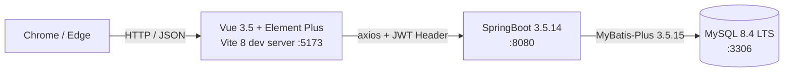
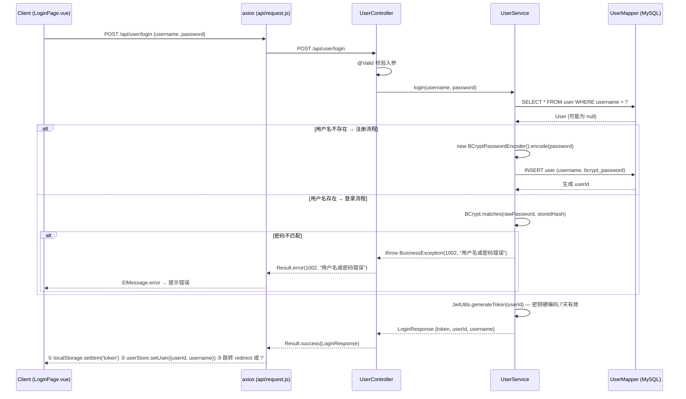
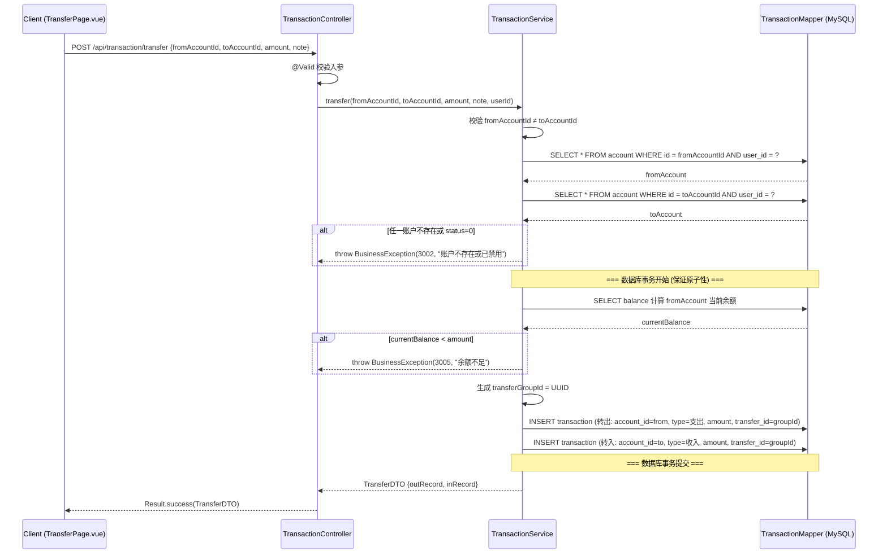
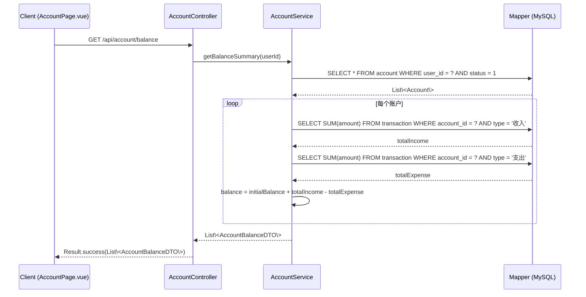
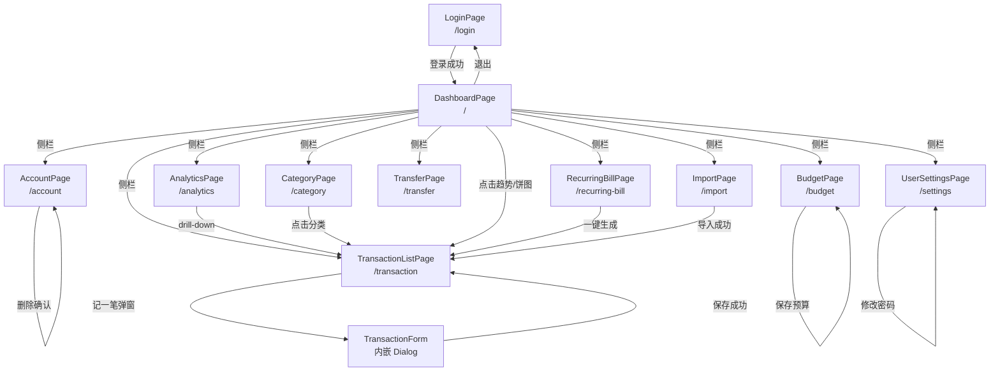

# 个人财务记账与分析系统 · 概要设计

> 版本: v1.0 · 生成日期: 2026-05-16 · 依据: `docs/PRD.md`（R-01 已审已修 · 9 条 issue 全部修复）

---

## §1 系统架构



三层架构，前后端分离：
- **前端**：Vue 3.5 + Element Plus 2.13.7 + Pinia 3.0.4 + Axios 1.15.2，Vite 8 dev server 运行于 :5173
- **后端**：SpringBoot 3.5.14 + MyBatis-Plus 3.5.15，运行于 :8080，统一 `/api/v1` 前缀
- **数据库**：MySQL 8.4 LTS，:3306，通过 MyBatis-Plus ORM 交互

---

## §2 后端模块划分

| 包路径 | 类型 | 职责 | 关键类（示例） |
|---|---|---|---|
| `controller/` | 业务层 | 接收 HTTP 请求 + 参数校验(@Valid) + 转发 Service | UserController / AccountController / TransactionController |
| `service/` + `service/impl/` | 业务层 | 业务逻辑 · 抛 BusinessException | UserService + UserServiceImpl / TransactionService + TransactionServiceImpl |
| `mapper/` | 数据访问层 | MyBatis-Plus BaseMapper · 简单 CRUD 用内置方法 | UserMapper extends BaseMapper\<User\> / AccountMapper |
| `entity/` | 数据访问层 | ORM 映射(@TableName / @TableId) | User / Account / Transaction / Budget / RecurringBill / Category |
| `config/` | 配置层 | CORS / MybatisPlus / WebMvc 等配置 | CorsConfig / MybatisPlusConfig / WebMvcConfig |
| `util/` | 工具层 | JwtUtils 等通用工具 | JwtUtils |
| `interceptor/` | 拦截层 | LoginInterceptor 校验 JWT | LoginInterceptor |
| `common/` | 通用层 | Result\<T\> + GlobalExceptionHandler + BusinessException | Result / GlobalExceptionHandler / BusinessException |

包名前缀：`com.example.finance`

---

## §3 前端路由设计

<!-- R-02-issue-4: 已修复 - 路由路径统一为 /transaction（单数），与 §6.9 页面路由表一致 -->
<!-- R-02-issue-7: 已修复 - TransactionFormPage 改为内嵌弹窗，不单独注册路由 -->

### 路由表

> 本节路由定义与 §6.9 页面路由表一致（§6.9 为权威源）。TransactionFormPage 作为 `el-dialog` 内嵌表单嵌入 TransactionListPage，不单独注册路由。

| 路径 | 组件名 | 守卫 | 角色限制 | 实现优先级 | 备注 |
|---|---|:---:|---|:---:|---|
| `/login` | LoginPage | ❌ 公开 | 全角色 | P0 | 登录/注册入口 |
| `/` | DashboardPage | ✅ 需登录 | 全角色 | P0 | 首页看板（P1-2 + P1-6 汇总图表） |
| `/account` | AccountPage | ✅ 需登录 | 全角色 | P0 | 账户管理 + 余额列（P0-2 + P0-5） |
| `/category` | CategoryPage | ✅ 需登录 | 全角色 | P0 | 分类浏览（P0-3） |
| `/transaction` | TransactionListPage | ✅ 需登录 | 全角色 | P0 | 流水列表 + 分页 + 筛选器 + 记一笔弹窗（P0-4 + P1-1） |
| `/budget` | BudgetPage | ✅ 需登录 | 全角色 | P1 | 预算设置 + 进度条（P1-3） |
| `/recurring-bill` | RecurringBillPage | ✅ 需登录 | 全角色 | P1 | 周期性账单管理（P1-4） |
| `/transfer` | TransferPage | ✅ 需登录 | 全角色 | P1 | 转账表单（P1-5） |
| `/analytics` | AnalyticsPage | ✅ 需登录 | 全角色 | P2 | 多图联动 + drill-down（P2-1） |
| `/import` | ImportPage | ✅ 需登录 | 全角色 | P2 | 银行 CSV 导入（P2-3） |
| `/settings` | UserSettingsPage | ✅ 需登录 | 全角色 | P1 | 用户设置（修改密码） |

> **CategorySelector** 是可复用组件（非独立页面），复用于 TransactionListPage 的分类选择，不单独注册路由。

### 登录后默认跳转映射

| 角色 | 登录成功后默认跳转 URL | 该 URL 在路由表中的「角色限制」必须包含 |
|---|---|---|
| 普通用户 | `/` (DashboardPage) | 全角色 |

### 路由守卫规则

```js
router.beforeEach((to) => {
  const token = localStorage.getItem('token');

  // 未登录 → 跳登录页（带 redirect 参数）
  if (to.meta.requiresAuth && !token) {
    return { path: '/login', query: { redirect: to.fullPath } };
  }

  // 已登录访问公开页（如 /login）→ 跳默认首页
  if (!to.meta.requiresAuth && token && to.path === '/login') {
    return '/';
  }
});
```

> 本系统为单一用户角色，无需"角色不匹配"分支。守卫仅做登录态校验。

---

## §4 关键业务流程图

<!-- R-02-issue-2: 已修复 - §4.4 注释补充 N+1 教学简化说明及批量查询优化方向 -->
<!-- R-02-issue-3: 已修复 - §4.2 补充 note 为可选参数说明 -->

### 4.1 登录流程（必含 · 全量项目通用）

<!-- R-02-issue-8: 已修复 - 前端步骤改为 3 步: localStorage 存 token + userStore.setUser({userId,username}) + 跳转 -->
<!-- R-02-issue-9: 已修复 - LoginResponse 增加 username 字段: {token, userId, username} -->



### 4.2 转账流程（P1-5 · 跨实体 · 含数据库事务保证原子性）

<!-- R-02-issue-5: 已修复 - 余额检查 SELECT 移入事务范围，利用 REPEATABLE READ 防并发透支 -->

> 入参说明：`note`（备注）为可选参数，允许为空。



> **并发安全**：转账使用数据库事务（`@Transactional`）包裹余额检查 + 两条 INSERT，利用 InnoDB REPEATABLE READ 隔离级别：事务内 SELECT 和 INSERT 共享同一快照，第二个并发事务会看到第一个事务未提交的锁定行而等待/失败，防止余额透支。教学简化：不做后端幂等，前端通过按钮 loading 状态防连点。

### 4.3 周期性账单一键生成流程（P1-4 · 跨模块 · 含账户状态校验）

```mermaid
sequenceDiagram
    participant C as Client (RecurringBillPage.vue)
    participant Ctrl as RecurringBillController
    participant S as RecurringBillService
    participant M as Mapper (MySQL)

    C->>Ctrl: POST /api/recurring-bill/{id}/generate
    Ctrl->>S: generate(id, userId)

    S->>M: SELECT * FROM recurring_bill WHERE id = ? AND user_id = ?
    M-->>S: bill
    alt bill 不存在
        S-->>Ctrl: throw BusinessException(5002, "周期性账单不存在")
    end
    alt bill.status = 0 (已停用)
        S-->>Ctrl: throw BusinessException(5002, "周期性账单已停用")
    end

    S->>M: SELECT * FROM account WHERE id = bill.account_id
    M-->>S: account
    alt account 不存在或 status=0
        S-->>Ctrl: throw BusinessException(5002, "关联账户已禁用，请先启用或更换账户")
    end

    S->>S: 构建 Transaction (amount=bill.amount, type=bill.type, category_id=bill.category_id, account_id=bill.account_id, time=bill.next_due_date)

    Note over S,M: === 数据库事务开始 (保证原子性) ===
    S->>M: UPDATE recurring_bill SET next_due_date = 计算新到期日 WHERE id = ? AND next_due_date = 当前到期日
    M-->>S: affectedRows
    alt affectedRows = 0
        S-->>Ctrl: throw BusinessException(5003, "到期日已被更新，请刷新后重试")
    end

    S->>M: INSERT transaction
    M-->>S: 新 transaction
    Note over S,M: === 数据库事务提交 ===

    S-->>Ctrl: TransactionDTO
    Ctrl-->>C: Result.success(TransactionDTO)
```

<!-- R-02-issue-6: 已修复 - UPDATE + INSERT 包裹在同一事务内，保证到期日推进与记录生成原子性 -->



> **并发安全**：`next_due_date` 使用条件 UPDATE（`WHERE next_due_date = 当前值`）+ `affectedRows` 判断 + INSERT 在同一 `@Transactional` 事务内，防止同一到期日被重复生成。若 UPDATE 的 `affectedRows = 0`，说明该到期日已被其他请求处理；事务保证到期日推进与收支记录生成的原子性（UPDATE 成功后 INSERT 失败会整体回滚）。

### 4.4 按账户汇总余额（P0-5 · 纯统计查询）



> 教学简化：余额每次实时计算，不做缓存或冗余字段存储。无收支记录的账户余额 = 初始余额（SUM 返回 NULL 时按 0 处理）。N+1 查询（每个账户 2 次 SELECT SUM），生产环境应优化为批量查询：`SELECT account_id, type, SUM(amount) FROM transaction WHERE account_id IN (...) GROUP BY account_id, type`，再在 Java 内存中聚合。

---

## §5 技术方案选型

<!-- R-02-issue-1: 已修复 - 文件上传方案独立成行，依据改为 CLAUDE.md §二·五（后端安全规范：本地存储 + 路径校验）+ PRD.md P2-3（数据约束） -->

| 选型项 | 决定 | 依据 |
|---|---|---|
| 认证 | JWT + jjwt 0.13.0（模块化：jjwt-api + jjwt-impl + jjwt-jackson） | CLAUDE.md §一·一·后端 |
| 密码加密 | `BCryptPasswordEncoder`（来自 `spring-security-crypto 6.3.4` 子模块） | CLAUDE.md §一·一·后端（避开完整 spring-boot-starter-security 的 Filter Chain） |
| 文件上传 | 本地存储方案：① 存储位置：`backend/uploads/`（项目根目录下，不与前端资源混放）② 允许类型：仅 `.csv`（前端 `accept=".csv"` + 后端 content-type 校验）③ 大小限制：单文件 ≤ 5MB（`spring.servlet.multipart.max-file-size`）④ 静态资源访问：`WebMvcConfigurer.addResourceHandlers` 映射 `/uploads/**` → `file:uploads/` ⑤ 安全校验：取 `MultipartFile.getOriginalFilename()` basename 防路径穿越 | CLAUDE.md §二·五（后端安全规范：本地存储 + 路径校验）+ PRD.md P2-3 数据约束（≤5MB + CSV 格式）· 教学统一本地存储不做 OSS |
| 分页 | MyBatis-Plus 3.5.15 内置 `PaginationInnerInterceptor`（IPage + Page\<T\>） | CLAUDE.md §一·一·后端 + §二·四 |
| 接口响应包装 | 统一 `Result<T>`（`{Integer code, String message, T data}`）+ 静态工厂 `Result.success()` / `Result.error()` | CLAUDE.md §一·三（全栈通用接口契约） |
| 全局异常 | `@RestControllerAdvice` 统一处理 → Result.error；业务异常用 `BusinessException(code, message)` | CLAUDE.md §二·三 |
| 跨域 | CorsConfig 允许 `http://localhost:5173`（`exposed-headers: Authorization`） | init-skeleton 生成 |
| 前端状态 | Pinia 3.0.4（禁止换 Vuex） | CLAUDE.md §一·一·前端 |
| 前端 HTTP | Axios 1.15.2 实例（baseURL `/api` + 拦截器 401 跳 /login + 业务错误 ElMessage 提示） | CLAUDE.md §一·三 + §三·三 |
| 错误码规范 | HTTP 状态码 + 业务码段双轨：400 参数错 / 401 未登录 / 403 无权限 / 404 不存在 / 500 服务端；业务码段：1xxx 用户 / 2xxx 账户 / 3xxx 交易 / 4xxx 预算 / 5xxx 周期账单。`Result.error(code, msg)` 中 code 必从此规范选 | PRD.md 附：统一错误码规范 |
| 日期与精度类型映射 | DECIMAL(12,2) → `BigDecimal`（金额/余额，**禁用 Double**）· DATETIME → `LocalDateTime`（Jackson ISO 8601 序列化）· DATE → `LocalDate` | CLAUDE.md §二·二 + PRD.md §3 各功能数据约束 |

---

## §5.5 教学简化声明

| 简化点 | 简化做法 | 完整方案（不实现 · 仅作答辩参考） |
|---|---|---|
| JWT 密钥 | 硬编码在 application.yml | 环境变量 / 密钥管理服务 |
| Token 过期 | 固定 7 天，无 refresh token 机制 | refresh token 双 token 方案 |
| 账户/周期性账单删除 | 软删除（改 status=0），禁用后不可恢复 | 支持恢复 / 物理删除 + 回收站 |
| 分类数据 | 种子数据预置，不做用户自定义增改删 | 用户自定义分类 + 分类管理 CRUD |
| 余额计算 | 每次实时查询计算，不做缓存 | 冗余 balance 字段 + 触发器/定时更新 |
| 预算粒度 | 仅月预算，不做周预算或自定义周期 | 支持多粒度预算（周/月/季/年） |
| 周期性账单 | 一键手动触发生成，@Scheduled 仅记日志 | 自动扣款 + 推送通知（短信/邮件） |
| 转账 | 两条收支记录 + transfer_id 关联，不做撤销 | 支持撤销 + 转账手续费 |
| ECharts 图表 | P1 仅 1 个（分类饼图），P2 扩展多图 | 完整 BI 看板 + 数据导出 |
| 预算预警阈值 | 硬编码日阈值 150%、月阈值 80% | 用户自定义阈值 + 多级预警 |
| CSV 导入 | 仅支持一种固定列格式（日期/金额/类型/备注） | 多银行格式适配 + 智能列匹配 |
| 多币种 | 固定 6 种 + 硬编码汇率，基准币种 CNY | 实时汇率接口 + 更多币种 |

---


## 6. 页面原型描述

> 基于 PRD §5 全量映射表（P0+P1+P2）生成，每页面 6 项字段全部必填：标题+URL / 实现优先级 / 布局 ASCII / Element Plus 组件 / 字段行为 / 跳转关系。Element Plus 2.13.7 风格，响应式布局。

---

### 6.0 AppLayout 全局布局

- **说明**: 除 LoginPage 外所有页面的公共布局壳，包裹在 `<router-view />` 外层
- **不套用**: LoginPage（独立全屏布局）
- **套用**: DashboardPage / AccountPage / CategoryPage / TransactionListPage / BudgetPage / RecurringBillPage / TransferPage / AnalyticsPage / ImportPage / UserSettingsPage

```
┌──────────────────────────────────────────────┐
│  个人财务记账系统           [用户名] [退出]   │  ← el-header (64px)
├─────┬────────────────────────────────────────┤
│ 首页│                                        │
│ 账户│                                        │
│ 分类│        <router-view />                 │  ← el-main (内容区)
│ 记账│                                        │
│ 预算│                                        │
│ 周期│                                        │
│ 转账│                                        │
│ 统计│                                        │
│ 导入│                                        │
│ 设置│                                        │
└─────┴────────────────────────────────────────┘
 ↑ el-aside (200px)     ↑ 响应式: <768px 侧栏折叠为 64px 图标模式
```

**顶栏区域**：
| 元素 | 组件 | 说明 |
|---|---|---|
| 系统名称 | `el-text`（左侧） | 「个人财务记账系统」，加粗 |
| 用户名 | `el-text` | 从 Pinia `useUserStore` 读取 |
| 退出按钮 | `el-button` text type | 点击清除 localStorage token → 跳转 `/login` |

**侧栏区域**：
| 菜单项 | 图标 | 路径 | 对应页面 | 优先级 |
|---|---|---|---|:---:|
| 首页 | `Odometer` | `/` | DashboardPage | P0 |
| 账户管理 | `Wallet` | `/account` | AccountPage | P0 |
| 分类管理 | `FolderOpened` | `/category` | CategoryPage | P0 |
| 交易记录 | `List` | `/transaction` | TransactionListPage | P0 |
| 预算管理 | `Coin` | `/budget` | BudgetPage | P1 |
| 周期账单 | `Calendar` | `/recurring-bill` | RecurringBillPage | P1 |
| 转账 | `Switch` | `/transfer` | TransferPage | P1 |
| 统计分析 | `DataAnalysis` | `/analytics` | AnalyticsPage | P2 |
| 导入 CSV | `Upload` | `/import` | ImportPage | P2 |
| 用户设置 | `Setting` | `/settings` | UserSettingsPage | P1 |

**响应式规则**：
- `>= 992px`：侧栏固定展开 200px
- `768px ~ 991px`：侧栏折叠为 64px 图标模式（`el-menu` collapse）
- `< 768px`：侧栏默认隐藏，顶栏增加「菜单」汉堡按钮触发抽屉 `el-drawer`

---

### 6.1 LoginPage（登录页）

- **URL**: `/login`
- **实现优先级**: P0 必做
- **布局**: 全屏居中卡片，不套用 AppLayout

```
┌─────────────────────────────────────────────────┐
│                                                 │
│              ┌─────────────────────┐            │
│              │ 个人财务记账与分析系统│            │
│              │                     │            │
│              │  [ 登录 ]  [ 注册 ] │ ← el-tabs  │
│              │  ─────────────────── │            │
│              │  用户名 [__________] │            │
│              │  密  码 [__________] │            │
│              │                     │            │
│              │  [     登  录     ]  │            │
│              └─────────────────────┘            │
│                                                 │
└─────────────────────────────────────────────────┘
```

**UI 组件列表**: `el-form` / `el-form-item` / `el-input` / `el-button` / `el-tabs` / `ElMessage`

**组件字段与行为**：
| 字段 | 组件 | 校验规则 | 说明 |
|---|---|---|---|
| 用户名 | `el-input` | required, 3-20 位字母/数字/下划线, maxlength=20 | placeholder="请输入用户名" |
| 密码 | `el-input` type=password | required, 6-20 位, maxlength=20 | placeholder="请输入密码" |
| 登录/注册按钮 | `el-button` type=primary, block | - | `POST /api/user/login` 或 `POST /api/user/register`；loading 防重复提交 |

**页面跳转关系**：
- 登录成功 -> ① localStorage.setItem('token') ② userStore.setUser({userId, username}) ③ 跳转 `/`（DashboardPage）
- 登录失败 -> `ElMessage.error`（axios 拦截器统一处理）
- 未登录访问其他页 -> 路由守卫重定向 `/login?redirect=原路径`

---

<!-- R-02b-issue-2: 已修复 - DashboardPage 新增预算预警提示区域（PRD P2-2） -->
<!-- R-02b-issue-3: 已修复 - DashboardPage 新增年度汇总卡片调用 GET /api/statistics/yearly -->
### 6.2 DashboardPage（首页看板）

- **URL**: `/`
- **实现优先级**: P0 必做
- **布局**: 顶部月份选择 + 月统计卡片行 + 预算预警条 + 中部趋势图 + 底部两列饼图

```
┌─────────────────────────────────────────────────┐
│ 月份 [2026-05 ▼]                      [刷新]    │
├─────────────────────────────────────────────────┤
│ ┌──────────┐  ┌──────────┐  ┌──────────┐       │
│ │ 本月收入  │  │ 本月支出  │  │ 本年累计  │       │
│ │ ¥12,000  │  │ ¥8,500   │  │ ¥96,000  │       │
│ │ ↑12%     │  │ ↓5%      │  │ 年度汇总  │       │
│ └──────────┘  └──────────┘  └──────────┘       │
├─────────────────────────────────────────────────┤
│ ⚠ 预算预警：交通已超支 ¥100，餐饮已用 90%       │
├─────────────────────────────────────────────────┤
│ ┌───────────────────────────────────────────┐   │
│ │        收支趋势折线图（近 12 个月）         │   │
│ │        X:月份  Y:金额  ━ 收入  ━ 支出     │   │
│ └───────────────────────────────────────────┘   │
├─────────────────────────────────────────────────┤
│ ┌─────────────────────┐ ┌─────────────────────┐ │
│ │  支出分类占比饼图    │ │  收入分类占比饼图    │ │
│ │  餐饮 38% / 交通 15%│ │  工资 80% / 兼职 20%│ │
│ └─────────────────────┘ └─────────────────────┘ │
└─────────────────────────────────────────────────┘
```

**UI 组件列表**: `el-date-picker` / `el-button` / `el-card` / `el-statistic` / `el-tag` / `el-alert` / ECharts（line + pie）

**组件字段与行为**：
| 元素 | 组件 | 接口 | 说明 |
|---|---|---|---|
| 月份选择 | `el-date-picker` type=month | - | 默认当月，切换刷新月度图表和卡片数据 |
| 刷新按钮 | `el-button` icon text | - | 重新请求所有数据 |
| 月统计卡片 x2 | `el-card` + `el-statistic` | `GET /api/statistics/monthly?year=&month=` | 本月收入 / 本月支出；环比变化用 `el-tag` 箭头表示 |
| 年度汇总卡片 | `el-card` + `el-statistic` | `GET /api/statistics/yearly?year=` | 本年累计收入/支出/结余（PRD P1-2） |
| 预算预警条 | `el-alert` type=warning/error | `GET /api/budget/alert` | 展示超支分类和接近阈值分类；无预警时隐藏（PRD P2-2） |
| 收支趋势折线图 | ECharts line | `GET /api/statistics/trend?year=` | 双线（收入/支出），X 轴 12 个月，Y 轴金额；点击高亮月份 |
| 支出分类饼图 | ECharts pie | `GET /api/statistics/category-summary?year=&month=&type=1` | 按支出分类展示占比 |
| 收入分类饼图 | ECharts pie | `GET /api/statistics/category-summary?year=&month=&type=2` | 按收入分类展示占比 |

**页面跳转关系**：
- 登录成功后默认跳转此页（`/`）
- 点击趋势图某月 -> drill-down 跳转 `/transaction?startTime=&endTime=`（带时间筛选参数）
- 点击饼图某分类 -> 跳转 `/transaction?categoryId=`（带分类筛选参数）

---

<!-- R-02b-issue-1: 已修复 - AccountPage 表单+表格补 currency 币种字段（PRD P2-4 多币种） -->
### 6.3 AccountPage（账户管理）

- **URL**: `/account`
- **实现优先级**: P0 必做
- **布局**: 顶部操作栏 + 表格

```
┌──────────────────────────────────────────────────────────┐
│  账户管理                                    [+ 新增账户] │
├──────────────────────────────────────────────────────────┤
│ ┌──────┬─────┬──────┬──────────┬──────────┬────────────┐ │
│ │ 名称 │类型 │ 币种 │ 初始余额  │ 当前余额  │   操作    │ │
│ ├──────┼─────┼──────┼──────────┼──────────┼────────────┤ │
│ │ 现金 │现金 │ CNY  │ ¥5,000   │ ¥4,200   │ 编辑│删除 │ │
│ │ 支付宝│电子 │ CNY  │ ¥3,000   │ ¥3,500   │ 编辑│删除 │ │
│ │ 美元 │银行 │ USD  │ $1,000   │ $1,050   │ 编辑│删除 │ │
│ └──────┴─────┴──────┴──────────┴──────────┴────────────┘ │
└──────────────────────────────────────────────────────────┘
```

**UI 组件列表**: `el-table` / `el-table-column` / `el-button` / `el-dialog` / `el-form` / `el-form-item` / `el-input` / `el-input-number` / `el-select` / `el-tag` / `el-message-box`

**组件字段与行为**：

表单弹窗（新增/编辑）：
| 字段 | 组件 | 校验规则 | 说明 |
|---|---|---|---|
| 账户名称 | `el-input` | required, 1-20 字符, maxlength=20 | placeholder="请输入账户名称" |
| 账户类型 | `el-select` | required | 选项：现金(1) / 银行卡(2) / 支付宝(3) / 微信(4) |
| 币种 | `el-select` | required, default=CNY | 选项：CNY / USD / EUR / JPY / GBP / HKD（PRD P2-4 固定 6 种） |
| 初始余额 | `el-input-number` | required, min=0, precision=2 | placeholder="0.00" |

表格列：
| 列 | 数据源 | 说明 |
|---|---|---|
| 名称 | `account.name` | - |
| 类型 | `account.type` | `el-tag` 映射：1=现金/2=银行卡/3=支付宝/4=微信 |
| 币种 | `account.currency` | 默认 CNY；多币种账户展示对应币种代码 |
| 初始余额 | `account.initialBalance` | 格式 ¥#,##0.00 |
| 当前余额 | `accountBalance.currentBalance` | 来自 `GET /api/account/balance` |
| 操作 | - | 编辑按钮 + 删除按钮（`el-button` type=danger） |

按钮：
| 按钮 | 接口 | 说明 |
|---|---|---|
| 新增账户 | - | 打开 `el-dialog` 新增弹窗 |
| 编辑 | - | 打开 `el-dialog` 预填数据 |
| 删除 | `DELETE /api/account/{id}` | `el-message-box` 二次确认（"确认禁用该账户？禁用后不可恢复"） |
| 弹窗-保存 | `POST /api/account` 或 `PUT /api/account/{id}` | loading 防重复提交 |
| 弹窗-取消 | - | 关闭弹窗 |

**页面跳转关系**：
- 从 AppLayout 侧栏「账户管理」进入

---

### 6.4 CategoryPage（分类浏览）

- **URL**: `/category`
- **实现优先级**: P0 必做
- **布局**: 顶部 tab 切换收入/支出 + 分类卡片网格

```
┌─────────────────────────────────────────────────┐
│  分类浏览                                         │
│  [ 支出分类 ] [ 收入分类 ]  ← el-tabs            │
├─────────────────────────────────────────────────┤
│ ┌──────────┐  ┌──────────┐  ┌──────────┐       │
│ │  餐饮     │  │  交通     │  │  购物     │       │
│ │ 本月 ¥3200│  │ 本月 ¥800 │  │ 本月 ¥1500│       │
│ └──────────┘  └──────────┘  └──────────┘       │
│ ┌──────────┐  ┌──────────┐  ┌──────────┐       │
│ │  住房     │  │  娱乐     │  │  医疗     │       │
│ │ 本月 ¥2500│  │ 本月 ¥600 │  │ 本月 ¥200 │       │
│ └──────────┘  └──────────┘  └──────────┘       │
└─────────────────────────────────────────────────┘
```

**UI 组件列表**: `el-tabs` / `el-tab-pane` / `el-card` / `el-tag`

**组件字段与行为**：
| 元素 | 组件 | 接口 | 说明 |
|---|---|---|---|
| tab 切换 | `el-tabs` | `GET /api/category` | 支出（type=1）/ 收入（type=2）切换过滤 |
| 分类卡片 | `el-card` | `GET /api/statistics/category-summary` | 展示分类名 + 本月金额；点击跳转交易列表 |

**页面跳转关系**：
- 从 AppLayout 侧栏「分类管理」进入
- 点击某分类卡片 -> 跳转 `/transaction?categoryId=`（查看该分类下交易记录）

---

### 6.5 TransactionListPage（交易记录）

- **URL**: `/transaction`
- **实现优先级**: P0 必做
- **布局**: 顶部筛选区 + 记一笔按钮 + 表格 + 分页

```
┌─────────────────────────────────────────────────┐
│  交易记录                              [+ 记一笔]│
├─────────────────────────────────────────────────┤
│ 时间 [________][________]  账户 [▼ 全部]        │
│ 分类 [▼ 全部]    关键词 [________]  [搜索][重置] │
├─────────────────────────────────────────────────┤
│ ┌───────┬────┬──────┬──────┬────────┬──────┐    │
│ │  时间  │类型│ 分类 │ 账户 │  金额  │ 操作 │    │
│ ├───────┼────┼──────┼──────┼────────┼──────┤    │
│ │05-16  │支出│ 餐饮 │ 现金 │ -50.00 │编辑  │    │
│ │05-16  │收入│ 工资 │支付宝│+5000.00│ 编辑 │    │
│ │05-15  │转出│ 转账 │ 现金 │-200.00 │  -   │    │
│ │05-15  │转入│ 转账 │支付宝│+200.00 │  -   │    │
│ └───────┴────┴──────┴──────┴────────┴──────┘    │
│                 [< 1 2 3 ... 10 >]               │
└─────────────────────────────────────────────────┘
```

**UI 组件列表**: `el-table` / `el-table-column` / `el-button` / `el-dialog` / `el-form` / `el-form-item` / `el-input` / `el-select` / `el-date-picker` / `el-radio-group` / `el-tag` / `el-pagination`

**组件字段与行为**：

筛选区：
| 字段 | 组件 | 说明 |
|---|---|---|
| 时间范围 | `el-date-picker` type=daterange | 跨度最大 1 年 |
| 账户 | `el-select` | 来自 `GET /api/account`，空 = 不过滤 |
| 分类 | `el-select` | 来自 `GET /api/category`，空 = 不过滤 |
| 关键词 | `el-input` | 模糊匹配备注，maxlength=50 |

记一笔弹窗：
| 字段 | 组件 | 校验规则 | 说明 |
|---|---|---|---|
| 类型 | `el-radio-group` | required | 支出 / 收入，切换联动分类选项 |
| 金额 | `el-input` | required, >0, precision=2 | placeholder="0.00" |
| 分类 | `el-select` | required | 按类型分组，来自 `GET /api/category` |
| 账户 | `el-select` | required | 仅活跃账户，来自 `GET /api/account` |
| 时间 | `el-date-picker` | required | 默认今天 |
| 备注 | `el-input` textarea | maxlength=200, 选填 | - |

表格列：
| 列 | 数据源 | 说明 |
|---|---|---|
| 时间 | `transaction.time` | 格式 MM-DD HH:mm |
| 类型 | `transaction.type` | `el-tag`：支出=danger / 收入=success / 转出=warning / 转入=primary |
| 分类 | `transaction.categoryName` | 转账记录显示「转账」 |
| 账户 | `transaction.accountName` | - |
| 金额 | `transaction.amount` | 支出 `-金额` / 收入 `+金额` |
| 操作 | - | 编辑按钮（转账记录隐藏） |

按钮：
| 按钮 | 接口 | 说明 |
|---|---|---|
| 记一笔 | - | 打开 `el-dialog` 记账弹窗 |
| 搜索 | `GET /api/transaction?...` | 组合筛选条件请求 |
| 重置 | - | 清空筛选条件，重新加载 |
| 编辑 | - | 打开 `el-dialog` 预填数据（转账记录隐藏此按钮） |
| 弹窗-保存 | `POST /api/transaction` 或 `PUT /api/transaction/{id}` | loading 防重复提交 |

弹窗：
| 弹窗 | 组件 | 说明 |
|---|---|---|
| 记一笔 | `el-dialog` width=520px | 内嵌 `el-form`（类型 + 金额 + 分类 + 账户 + 时间 + 备注） |
| 编辑记录 | `el-dialog` width=520px | 同记一笔表单，预填数据；transferId 非空时金额字段禁用（`el-input` disabled） |

**页面跳转关系**：
- 从 AppLayout 侧栏「交易记录」进入
- 从 DashboardPage drill-down 带筛选参数进入
- 从 CategoryPage 点击分类卡片进入
- 从 AnalyticsPage drill-down 进入
- 从 RecurringBillPage 一键生成成功后进入
- 从 ImportPage 导入成功后进入
- 记一笔/编辑成功 -> `ElMessage.success` -> 刷新当前列表

---

<!-- R-02b-issue-2(续): 已修复 - BudgetPage 新增预警标识列（PRD P2-2） -->
### 6.6 BudgetPage（预算管理）

- **URL**: `/budget`
- **实现优先级**: P1 应做
- **布局**: 月份选择 + 预算表格（含预警列） + 进度条

```
┌─────────────────────────────────────────────────────────────┐
│  预算管理                                                    │
│  月份 [2026-05 ▼]                                           │
├─────────────────────────────────────────────────────────────┤
│ ┌──────────┬──────────┬──────────┬────────────┬───────────┐ │
│ │ 支出分类  │  预算金额 │  已用金额 │   状态     │   预警    │ │
│ ├──────────┼──────────┼──────────┼────────────┼───────────┤ │
│ │  餐饮    │  2000.00 │  1800.00 │ ██████░░  │  接近阈值  │ │
│ │  交通    │   500.00 │   600.00 │ 超支!     │  已超支   │ │
│ │  购物    │  1000.00 │   300.00 │ ██░░░░░░  │  正常     │ │
│ │  住房    │  [输入]  │     -    │     -      │    -      │ │
│ └──────────┴──────────┴──────────┴────────────┴───────────┘ │
│                     [ 保存预算 ]                             │
└─────────────────────────────────────────────────────────────┘
```

**UI 组件列表**: `el-date-picker` / `el-table` / `el-table-column` / `el-input-number` / `el-progress` / `el-tag` / `el-button`

**组件字段与行为**：
| 元素 | 组件 | 接口 | 说明 |
|---|---|---|---|
| 月份选择 | `el-date-picker` type=month | - | 默认当月，切换重新加载 |
| 预算金额 | `el-input-number` inline-edit | - | min=0, precision=2；未设置分类可直接输入 |
| 已用金额 | - | `GET /api/budget/progress` | 只读 |
| 状态 | `el-progress` | - | 正常=success，超支=exception + `el-tag` type=danger「超支!」 |
| 预警 | `el-tag` | `GET /api/budget/alert` | 正常=info / 接近日阈值=warning / 已超支=danger（PRD P2-2 预算预警） |
| 保存预算 | `el-button` type=primary | `POST /api/budget` | 批量提交当前月所有修改 |

**页面跳转关系**：
- 从 AppLayout 侧栏「预算管理」进入

---

<!-- R-02b-issue-4: 已修复 - AnalyticsPage 优先级从 P1 改为 P2，对齐 PRD §5 P2-1 -->
### 6.7 AnalyticsPage（统计分析）

- **URL**: `/analytics`
- **实现优先级**: P2 可选
- **布局**: 年份选择 + 趋势折线图 + 底部两列饼图/条形图

```
┌─────────────────────────────────────────────────┐
│  统计分析                                         │
│  年份 [2026 ▼]                                   │
├─────────────────────────────────────────────────┤
│ ┌───────────────────────────────────────────┐   │
│ │                                           │   │
│ │        年度收支趋势折线图（12 个月）        │   │
│ │        X:月份  Y:金额  ━ 收入  ━ 支出     │   │
│ │        (点击月份可联动下方图表)             │   │
│ │                                           │   │
│ └───────────────────────────────────────────┘   │
├───────────────────────┬─────────────────────────┤
│ ┌───────────────────┐ │ ┌─────────────────────┐ │
│ │  月度分类占比饼图  │ │ │  预算 vs 实际条形图 │ │
│ │  (联动上方月份)   │ │ │  餐饮 2000/1800     │ │
│ │                   │ │ │  交通  500/ 600     │ │
│ └───────────────────┘ │ └─────────────────────┘ │
└───────────────────────┴─────────────────────────┘
```

**UI 组件列表**: `el-date-picker` / `el-empty` / ECharts（line + pie + bar）

**组件字段与行为**：
| 元素 | 组件 | 接口 | 说明 |
|---|---|---|---|
| 年份选择 | `el-date-picker` type=year | - | 默认当年，切换刷新所有图表 |
| 年度趋势折线图 | ECharts line | `GET /api/statistics/trend?year=` | 点击某月 -> 联动饼图切换到该月数据 |
| 月度分类饼图 | ECharts pie | `GET /api/statistics/category-summary?year=&month=` | 被趋势图联动；默认当月 |
| 预算 vs 实际条形图 | ECharts bar | `GET /api/budget/progress?year=&month=` | 每个分类双柱（预算/实际），超支标红 |

**空状态**：无数据时 `el-empty` 提示「暂无数据，去记一笔吧」

**页面跳转关系**：
- 从 AppLayout 侧栏「统计分析」进入
- 点击饼图某分类 -> drill-down 跳转 `/transaction?categoryId=&startTime=&endTime=`
- 点击趋势图某月 -> drill-down 跳转 `/transaction?startTime=&endTime=`

---

### 6.8 UserSettingsPage（用户设置）

- **URL**: `/settings`
- **实现优先级**: P1 应做
- **布局**: 左右分栏（信息卡片 + 表单区域）

```
┌─────────────────────────────────────────────────┐
│  用户设置                                         │
├────────────────────┬────────────────────────────┤
│  ┌──────────────┐  │  修改密码                  │
│  │   用户信息    │  │  ┌────────────────────┐   │
│  │              │  │  │ 原密码 [__________]│   │
│  │  用户名:     │  │  │ 新密码 [__________]│   │
│  │  zhangsan    │  │  │ 确认密码 [________]│   │
│  │              │  │  │                    │   │
│  │  注册时间:    │  │  │  [ 保存修改 ]      │   │
│  │  2026-05-10  │  │  └────────────────────┘   │
│  └──────────────┘  │                            │
│                    │  系统信息                   │
│                    │  版本: v1.0                │
│                    │  技术栈: SpringBoot + Vue3  │
└────────────────────┴────────────────────────────┘
```

**UI 组件列表**: `el-form` / `el-form-item` / `el-input` / `el-button` / `el-card` / `el-text`

**组件字段与行为**：
| 字段 | 组件 | 校验规则 | 说明 |
|---|---|---|---|
| 用户名展示 | `el-text` | - | 从 Pinia `useUserStore.username` 读取，只读 |
| 原密码 | `el-input` type=password | required, 6-20 位 | placeholder="请输入原密码" |
| 新密码 | `el-input` type=password | required, 6-20 位 | placeholder="请输入新密码" |
| 确认密码 | `el-input` type=password | required, 与新密码一致 | 自定义 rule 校验 match |
| 保存修改 | `el-button` type=primary | - | `POST /api/user/change-password`；loading 防重复提交 |

**页面跳转关系**：
- 从 AppLayout 侧栏「用户设置」进入

---

### 6.9 RecurringBillPage（周期性账单）

- **URL**: `/recurring-bill`
- **实现优先级**: P1 应做
- **布局**: 顶部操作栏 + 表格 + 弹窗表单

```
┌─────────────────────────────────────────────────┐
│  周期性账单                         [+ 新增账单] │
├─────────────────────────────────────────────────┤
│ ┌────────┬────┬──────┬──────┬──────┬──────┬───┐ │
│ │  名称  │类型│ 金额 │ 分类 │ 账户 │周期  │操作│ │
│ ├────────┼────┼──────┼──────┼──────┼──────┼───┤ │
│ │ 月房租 │支出│2500  │ 住房 │银行卡│ 每月 │...│ │
│ │ 月工资 │收入│8000  │ 工资 │银行卡│ 每月 │...│ │
│ │ 网费   │支出│ 120  │ 娱乐 │支付宝│ 每月 │...│ │
│ └────────┴────┴──────┴──────┴──────┴──────┴───┘ │
└─────────────────────────────────────────────────┘
```

**UI 组件列表**: `el-table` / `el-table-column` / `el-button` / `el-dialog` / `el-form` / `el-form-item` / `el-input` / `el-input-number` / `el-select` / `el-radio-group` / `el-date-picker` / `el-tag` / `el-message-box`

**组件字段与行为**：

表单弹窗（新增/编辑）：
| 字段 | 组件 | 校验规则 | 说明 |
|---|---|---|---|
| 名称 | `el-input` | required, 1-30 字符, maxlength=30 | placeholder="请输入账单名称" |
| 类型 | `el-radio-group` | required | 支出 / 收入，切换联动分类选项 |
| 金额 | `el-input` | required, >0, precision=2 | placeholder="0.00" |
| 分类 | `el-select` | required | 按类型分组，来自 `GET /api/category` |
| 账户 | `el-select` | required | 仅活跃账户，来自 `GET /api/account` |
| 周期 | `el-select` | required | 选项：monthly=每月 / weekly=每周 |
| 下次到期日 | `el-date-picker` | required | 默认下个月今天 |

表格列：
| 列 | 数据源 | 说明 |
|---|---|---|
| 名称 | `bill.name` | - |
| 类型 | `bill.type` | `el-tag`：支出=danger / 收入=success |
| 金额 | `bill.amount` | 格式 ¥#,##0.00 |
| 分类 | `bill.categoryName` | - |
| 账户 | `bill.accountName` | 账户已禁用时显示 `el-tag` type=warning「账户已禁用」 |
| 周期 | `bill.cycle` | 映射：monthly=每月 / weekly=每周 |
| 操作 | - | 编辑 / 停用 / 生成按钮 |

按钮：
| 按钮 | 接口 | 说明 |
|---|---|---|
| 新增账单 | - | 打开 `el-dialog` 新增弹窗 |
| 编辑 | - | 打开 `el-dialog` 预填数据（仅 status=1 的活跃账单可编辑） |
| 停用 | `DELETE /api/recurring-bill/{id}` | `el-message-box` 二次确认（"确认停用？停用后不可恢复"）；仅 status=1 可停用 |
| 生成 | `POST /api/recurring-bill/{id}/generate` | 仅到期且 status=1 的账单显示；生成后 `ElMessage.success` |
| 弹窗-保存 | `POST /api/recurring-bill` 或 `PUT /api/recurring-bill/{id}` | loading 防重复提交 |
| 弹窗-取消 | - | 关闭弹窗 |

弹窗：
| 弹窗 | 组件 | 说明 |
|---|---|---|
| 新增/编辑账单 | `el-dialog` width=520px | 内嵌 `el-form`（名称 + 类型 + 金额 + 分类 + 账户 + 周期 + 下次到期日）；编辑时 title="编辑周期性账单" 预填数据 |

**页面跳转关系**：
- 从 AppLayout 侧栏「周期账单」进入
- 生成成功 -> `ElMessage.success` -> 跳转 `/transaction` 查看刚生成的收支记录

---

### 6.10 TransferPage（转账）

- **URL**: `/transfer`
- **实现优先级**: P1 应做
- **布局**: 居中表单卡片

```
┌─────────────────────────────────────────────────┐
│  转账                                             │
├─────────────────────────────────────────────────┤
│           ┌─────────────────────────┐            │
│           │  转出账户 [▼ 请选择  ]  │            │
│           │  转入账户 [▼ 请选择  ]  │            │
│           │  金    额 [__________]  │            │
│           │  备    注 [__________]  │            │
│           │                         │            │
│           │  [     确认转账      ]  │            │
│           └─────────────────────────┘            │
└─────────────────────────────────────────────────┘
```

**UI 组件列表**: `el-form` / `el-form-item` / `el-select` / `el-input` / `el-button`

**组件字段与行为**：
| 字段 | 组件 | 校验规则 | 说明 |
|---|---|---|---|
| 转出账户 | `el-select` | required, 与转入账户不同 | 仅活跃账户，来自 `GET /api/account` |
| 转入账户 | `el-select` | required, 与转出账户不同 | 仅活跃账户，来自 `GET /api/account`；自定义 rule 排除已选转出账户 |
| 金额 | `el-input` | required, >0, precision=2 | placeholder="0.00" |
| 备注 | `el-input` textarea | maxlength=200, 选填 | placeholder="转账备注（可选）" |
| 确认转账 | `el-button` type=primary, block | - | `POST /api/transaction/transfer`；loading 防重复提交（防连点导致金额翻倍） |

**页面跳转关系**：
- 从 AppLayout 侧栏「转账」进入
- 转账成功 -> `ElMessage.success`（"转账成功"）-> 清空表单
- 转账失败 -> `ElMessage.error`（axios 拦截器统一处理）

---

### 6.11 ImportPage（导入 CSV）

- **URL**: `/import`
- **实现优先级**: P2 可选
- **布局**: 顶部账户选择 + 文件上传区 + 中部预览表格 + 底部导入按钮

```
┌─────────────────────────────────────────────────┐
│  导入 CSV                                         │
├─────────────────────────────────────────────────┤
│  目标账户 [▼ 请选择  ]                            │
│  ┌───────────────────────────────────────────┐   │
│  │         拖拽 CSV 文件到此处                 │   │
│  │         或点击上传（≤5MB）                  │   │
│  │         [ 选择文件 ]                       │   │
│  └───────────────────────────────────────────┘   │
├─────────────────────────────────────────────────┤
│  预览（共 15 条，有效 13 条，错误 2 条）          │
│ ┌───────┬────────┬──────┬──────┬────────────┐    │
│ │  行号  │  日期   │ 金额 │ 类型 │   状态     │    │
│ ├───────┼────────┼──────┼──────┼────────────┤    │
│ │  1    │05-01   │ 50.00│ 支出 │ ✓ 有效     │    │
│ │  2    │05-02   │200.00│ 收入 │ ✓ 有效     │    │
│ │  3    │error   │  -   │  -   │ ✗ 日期格式  │    │
│ └───────┴────────┴──────┴──────┴────────────┘    │
│              [ 确认导入（13 条）]                 │
└─────────────────────────────────────────────────┘
```

**UI 组件列表**: `el-select` / `el-upload`（drag）/ `el-table` / `el-table-column` / `el-tag` / `el-button` / `ElMessage`

**组件字段与行为**：
| 字段 | 组件 | 校验规则 | 说明 |
|---|---|---|---|
| 目标账户 | `el-select` | required | 仅活跃账户，来自 `GET /api/account` |
| CSV 文件 | `el-upload` drag | required, accept=".csv", <=5MB | 拖拽或点击上传；上传后客户端解析预览 |
| 确认导入 | `el-button` type=primary | - | `POST /api/transaction/import`；仅有效条数 > 0 时可点击；loading 防重复提交 |

预览表格列：
| 列 | 数据源 | 说明 |
|---|---|---|
| 行号 | `row.index` | CSV 原始行号 |
| 日期 | `row.date` | 解析后的日期 |
| 金额 | `row.amount` | 解析后的金额 |
| 类型 | `row.type` | 收入/支出 |
| 备注 | `row.note` | - |
| 状态 | `row.valid` | `el-tag`：有效=success / 错误=danger + 具体错误原因 |

**页面跳转关系**：
- 从 AppLayout 侧栏「导入 CSV」进入
- 导入成功 -> `ElMessage.success`（"成功导入 N 条"）-> 清空上传区域和预览表格

---

## 6.12 页面路由表

> 以下路由表为 §6 页面原型对应的前端路由定义，与 §3 路由设计对齐。

| 路径 | 组件名 | 守卫 | 布局 | 优先级 | 对应页面 |
|---|---|:---:|---|:---:|---|
| `/login` | LoginPage | 公开 | 无（独立全屏） | P0 | 6.1 登录页 |
| `/` | DashboardPage | 需登录 | AppLayout | P0 | 6.2 首页看板 |
| `/account` | AccountPage | 需登录 | AppLayout | P0 | 6.3 账户管理 |
| `/category` | CategoryPage | 需登录 | AppLayout | P0 | 6.4 分类浏览 |
| `/transaction` | TransactionListPage | 需登录 | AppLayout | P0 | 6.5 交易记录 |
| `/budget` | BudgetPage | 需登录 | AppLayout | P1 | 6.6 预算管理 |
| `/recurring-bill` | RecurringBillPage | 需登录 | AppLayout | P1 | 6.9 周期性账单 |
| `/transfer` | TransferPage | 需登录 | AppLayout | P1 | 6.10 转账 |
| `/analytics` | AnalyticsPage | 需登录 | AppLayout | P2 | 6.7 统计分析 |
| `/import` | ImportPage | 需登录 | AppLayout | P2 | 6.11 导入 CSV |
| `/settings` | UserSettingsPage | 需登录 | AppLayout | P1 | 6.8 用户设置 |

> **记一笔弹窗**：TransactionFormPage 作为 `el-dialog` 内嵌表单嵌入 TransactionListPage，不单独注册路由。

**登录后默认跳转**：`/`（DashboardPage）

---

## 6.13 页面流程图



**页面导航矩阵**（从哪来 -> 到哪去）：

| 来源页面 | 目标页面 | 触发条件 |
|---|---|---|
| LoginPage | DashboardPage | 登录/注册成功 |
| DashboardPage | TransactionListPage | 点击趋势图月份 / 点击饼图分类 |
| CategoryPage | TransactionListPage | 点击分类卡片 |
| AnalyticsPage | TransactionListPage | drill-down（趋势图月份 / 饼图分类） |
| RecurringBillPage | TransactionListPage | 一键生成收支记录成功 |
| ImportPage | TransactionListPage | 导入 CSV 成功 |
| 所有 AppLayout 页面 | LoginPage | 点击退出按钮 |
| AppLayout 侧栏 | 任意 AppLayout 页面 | 点击侧栏菜单项 |
